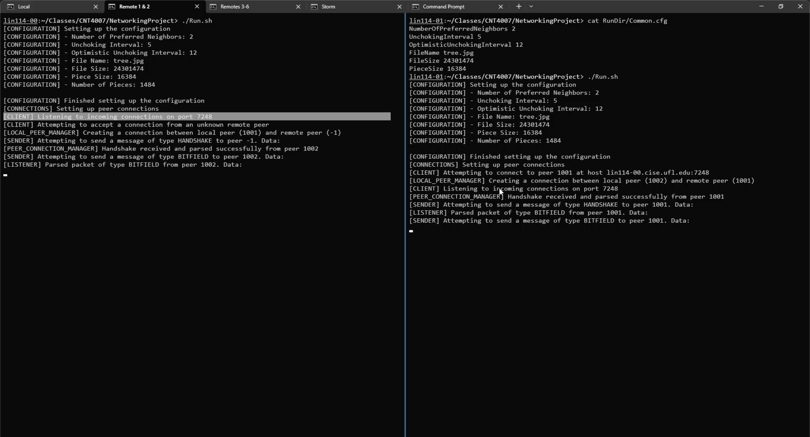
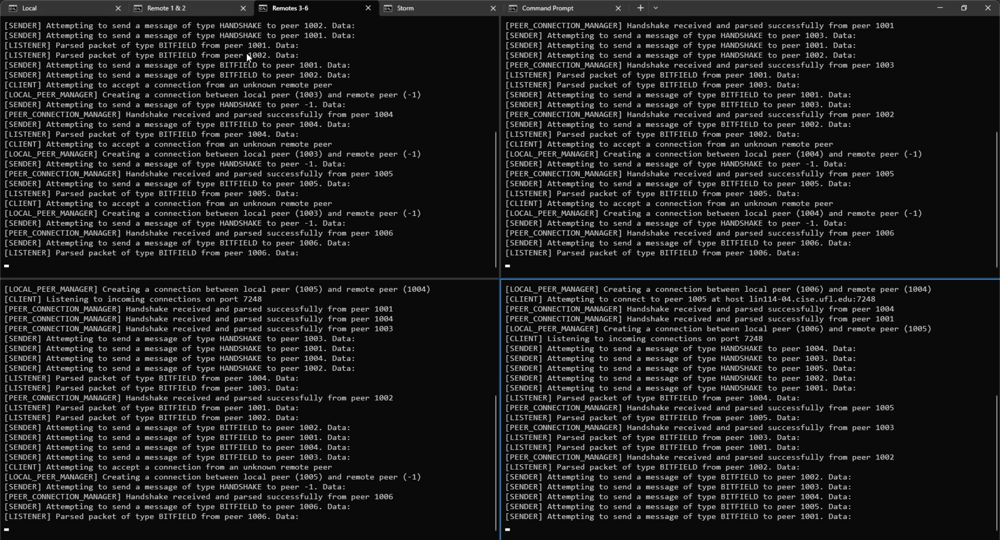

<div align="center">
  
  <h1 align="center" style="border-bottom: none"><b>CNT4007 - Computer Networks</b></h1>

  <p align="left">
    While I was an exchange student at the University of Florida, I had taken this class which focuses on understanding computer networks.
    <br>
    More information can be found <a href="https://www.cise.ufl.edu/~helmy/F15/Syllabus-CNT4007-F15.pdf">Here</a>.
  </p>
</div>

<br>

<div align="left">
  <h2 align="left" style="border-bottom: 1px solid gray">Project</h2>

  During this class, I teamed up with 2 other students to build a Torrent client in Java.
  <br>
  This client allows multiple peers to hook up using UDP connects (through the Java Socket API), and then receive & sends pieces of a given file.

  
  #### Compiling the code
  ```javac -d . src/project/*.java src/project/connection/*.java src/project/connection/piece/*.java src/project/exceptions/*.java src/project/message/*.java src/project/message/packet/*.java src/project/message/packet/packets/*.java src/project/message/InternalMessage/*.java src/project/message/InternalMessage/InternalMessages/*.java src/project/utils/*.java ```
  <br>
  
  Through batch
  <br>
  ```for /r %%a in (.) do (javac %%a\*.java)```

  #### Running the code
  ```java project.PeerProcess```
</div>

<br>

<div align="left">
  <h2 align="left" style="border-bottom: 1px solid gray">Media</h2>

  <div align="left">
    <a href="./projects/09"></a>
    <br>
    <a href="./projects/09"></a>
  </div>
</div>

<br>

<div align="left">
  <h2 align="left" style="border-bottom: 1px solid gray">Contributing</h2>

  <p align="left">
    Pull requests are welcome. For major changes, please open an issue first to discuss what you would like to change.
  </p>
</div>

<br>

<div align="left">
  <h2 align="left" style="border-bottom: 1px solid gray">License</h2>

  <p align="left">
    <a href="https://creativecommons.org/licenses/by-nc-sa/3.0/">Licensed under Creative Common Attribution-NonCommercial-ShareAlike 3.0 Unported License</a>
  </p>
</div>
